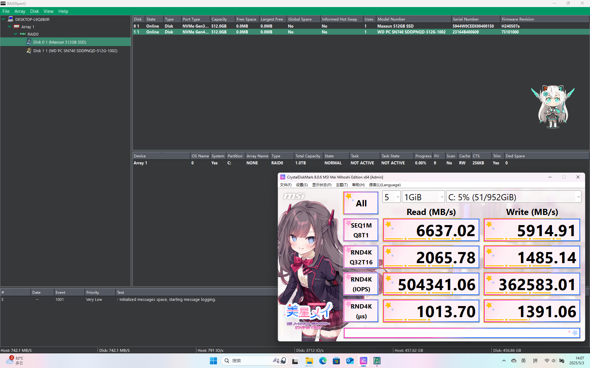
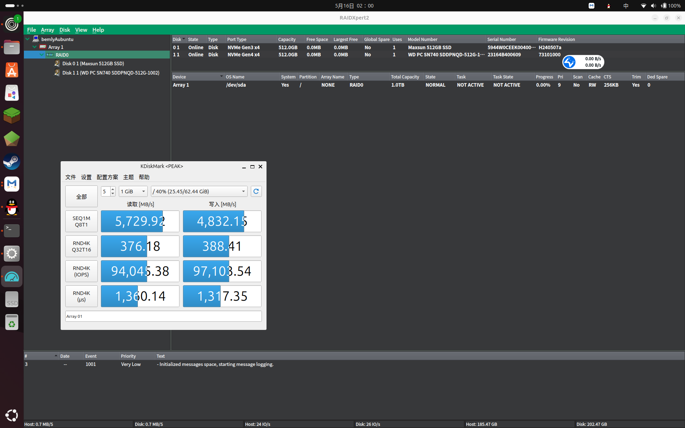

rcraid-patch-932
===========
Inofficial patch driver AMD RAID( aka rcraid ) to work in linux 6.14 and above

The code only patch free sdk code driver, dont include rcblob.

Warning
===========
This project is currently unstable, and its rcraid driver performance in Linux is approximately **10 times weaker** than that observed with Windows driver. Therefore, it is **not recommended** for deployment in a production environment.

 

Foreword
===========
Only Fakeraid Controller in BIOS with modern AMD CPU.

Install for Ubuntu
===========

Preparation:
-----------
  * burn the ISO Image to usb. (Recommend linux distro kernel >=5.0.0)
  * Append `modprobe.blacklist=ahci,nvme` to `linux	/casper/vmlinuz  ---` and `linux	/casper/vmlinuz nomodeset  ---` in USB:/boot/grub/grub.cfg
  * Append `modprobe.blacklist=ahci,nvme` to `linux	/casper/vmlinuz  iso-scan/filename=${iso_path} ---` and `linux	/casper/vmlinuz nomodeset  iso-scan/filename=${iso_path} ---` in USB:/boot/grub/loopback.cfg
  * Reboot
  * Switch to RAID mode in BIOS

PreInstall:
-----------
  * Download 9.3.2 rcraid on AMD offical: https://www.amd.com/en/support/chipsets/amd-socket-strx4/trx40
  * Put rcraid driver into usb
  * Boot your Linux installation from a USB disk
  * Note: rcraid SDK make only working on Linux filesystem!
```
sudo apt update
sudo apt install build-essential dwarves git mokutil
cd <your_rcraid_sdk_path>
git clone https://github.com/Bemly/rcraid-patch-932.git
patch -p1 < rcraid-patch-932/rcraid-932.patch
cd src/
sudo make clean
sudo make
sudo insmod rcraid.ko
```

Install:
-----------
* Install Ubuntu normally

PostInstall (don't restart):
-----------
```
sudo cp rcraid.ko /target/lib/modules/`uname -r`/kernel/drivers/scsi/rcraid.ko
sudo chroot /target
```
  * Into chroot view
```
depmod -a `uname -r`
cp -ap /boot/initrd.img-`uname -r` /boot/initrd.img-`uname -r`.bak
mkinitramfs -o /boot/initrd.img-`uname -r` `uname -r`
```
  * Click `Restart` Button in Installer.

Thanks
===========
https://github.com/Trololo87/rcraid-dkms
